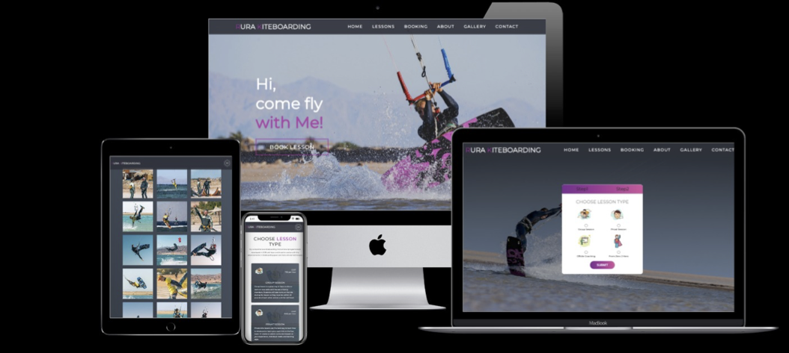
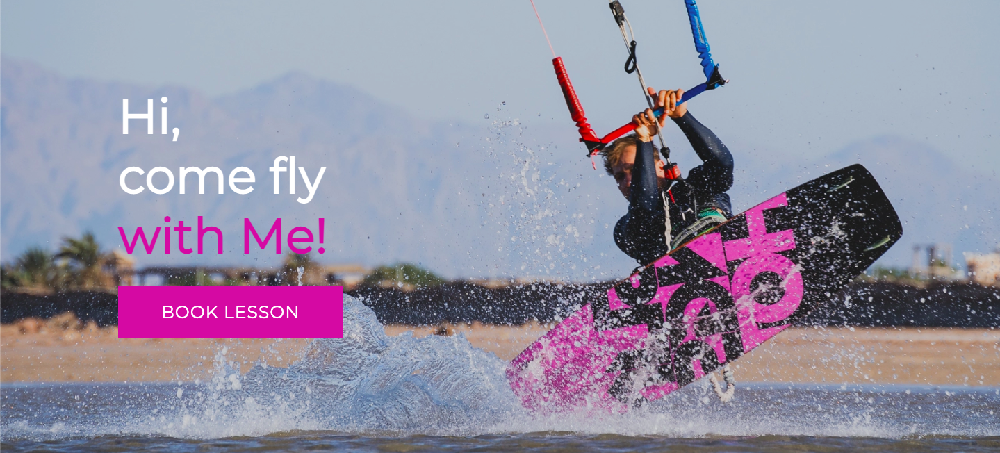
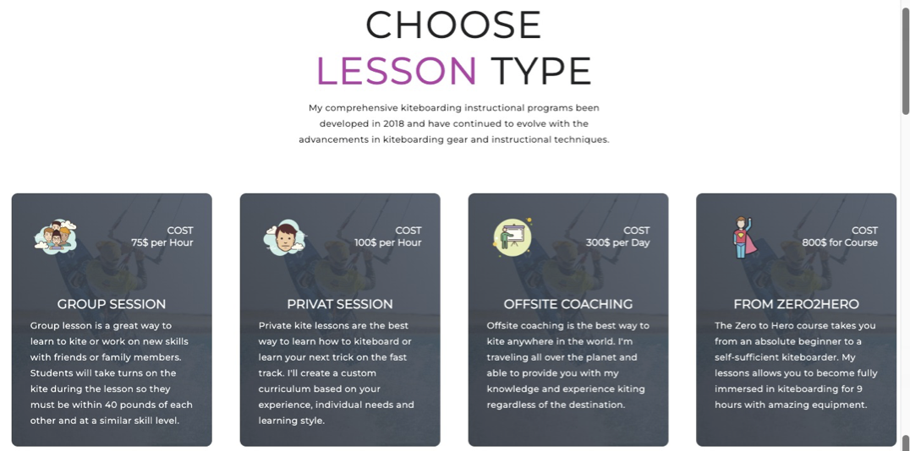
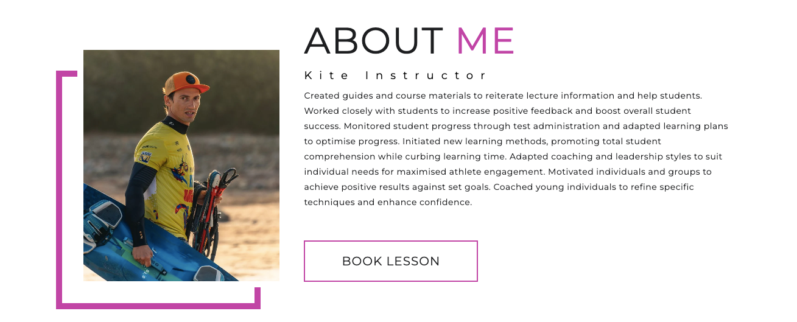
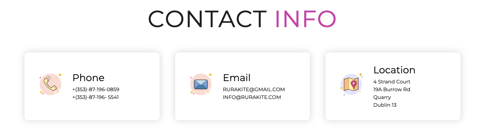
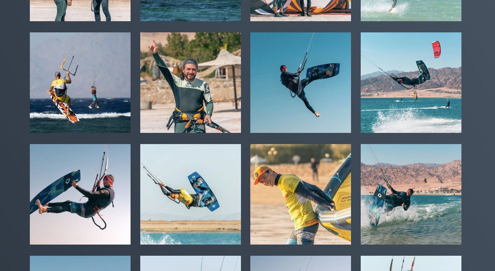
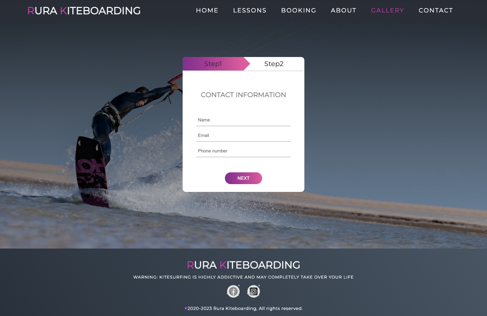

# Rura Kiteboarding

Rura Kiteboarding is a website where you can book a lesson or course with professional kiteboarder and certified instructor Viktor Rura. The site will help you to decide the lesson plan you need.

## Existing Features

- __Navigation Bar__

  - Featured on all three pages, the full responsive navigation bar includes links to the Logo, Lessons Types, About, Contacts and Home page, Gallery page, Booking page and is identical in each page to allow for easy navigation.
  - This section will allow the user to easily navigate from page to page across all devices without having to revert back to the previous page via the ‘back’ button. 

  

  - For smartphones and tablets was implemented the code allowing hide the menu into the animated humburger bar.

  

- __The landing page image__

    - The landing includes a photograph with an animated text overlay to grab user's attention.
  - This section introduces the user to Rura Kiteboarding website and allows to press the button to book a lesson immediately transfering to the Booking page.

  

- __Lessons Section__
  - The lessons section will allow the user to see and choose the type of the lesson what fits better for him.
  - The user can read description of each type of the training and see the cost of it.
  - This section is fully responsive for all types of devices.

  

- __About Me Section__
  - This section will introduce the instructor to the user.
  - User can see the portrait of instructor.
  - This section also has a button allows user to book a lesson, transferring to the Booking page.

  

- __Contact Section__
  - This section provides contact information for user to get in touch with instructor.

  

- __Footer Section__
  - The footer section includes links to the relevant social media sites for instructor. The links will open to a new tab to allow easy navigation for the user. 
  - The footer is valuable to the user as it encourages them to keep connected via social media.

  

- __Gallery Page__
  - The gallery will provide the user the visual understanding of what we can learn at lessons with instructor.

  

- __Booking Page__
  - This page will allow the user to get booked the lesson what is best fits for him.
  
  

### Validator Testing 

- HTML
  - No errors were returned when passing through the official [W3C validator](https://validator.w3.org/nu/?doc=https%3A%2F%2Frurakite.github.io%2Fkite-lessons%2Fgallery.html)
- CSS
  - No errors were found when passing through the official [(Jigsaw) validator](https://jigsaw.w3.org/css-validator/validator?uri=https%3A%2F%2Frurakite.github.io%2Fkite-lessons%2Findex.html&profile=css3svg&usermedium=all&warning=1&vextwarning=&lang=ru)